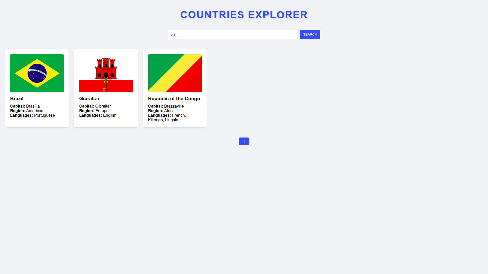

# Countries Explorer (Rest Countries API Frontend)

"Rest Countries API" it's a simple API that returns data about countries all over the globe. 

This simple project is responsible for acquiring that data and displaying the countries as a paginated list, on which there's some of the main pieces of information about them.

It is also possible to search for the countries' names, filtering them as you like.

## Installation

You can install the project by downloading the repository contents. There is a button "Download ZIP" inside the "Code" button, where you can download the compressed folder containing the repository contents. From there, extract the contents of the ZIP file to access the contents.

## Execution

You can execute the project by clicking on the "index.html" file, which will open on your main browser right after.

## Screenshots

Initial results:

Search with results:

Search with no results:

